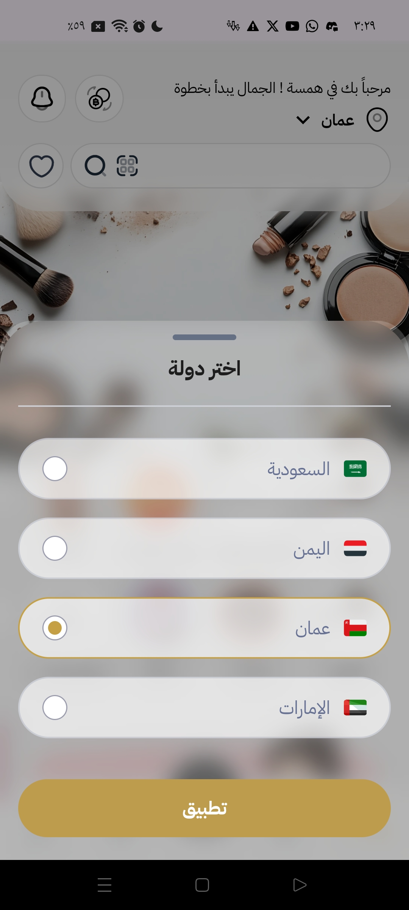
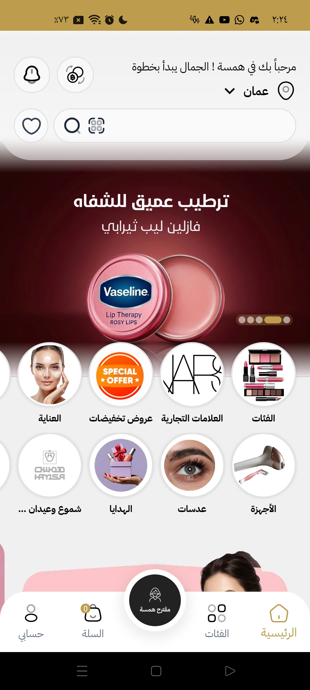
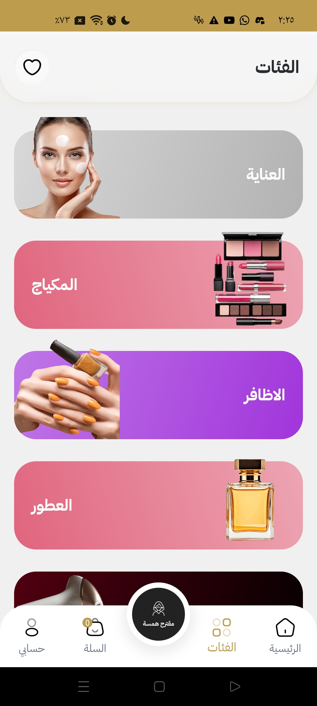
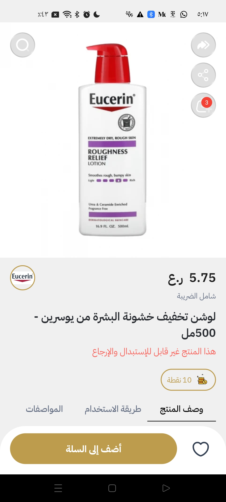
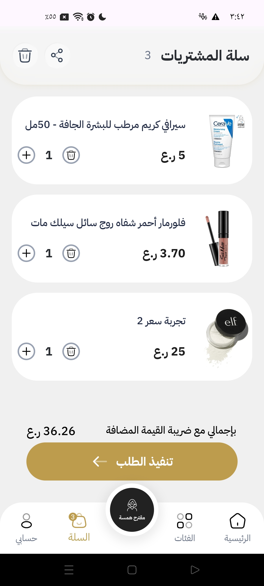
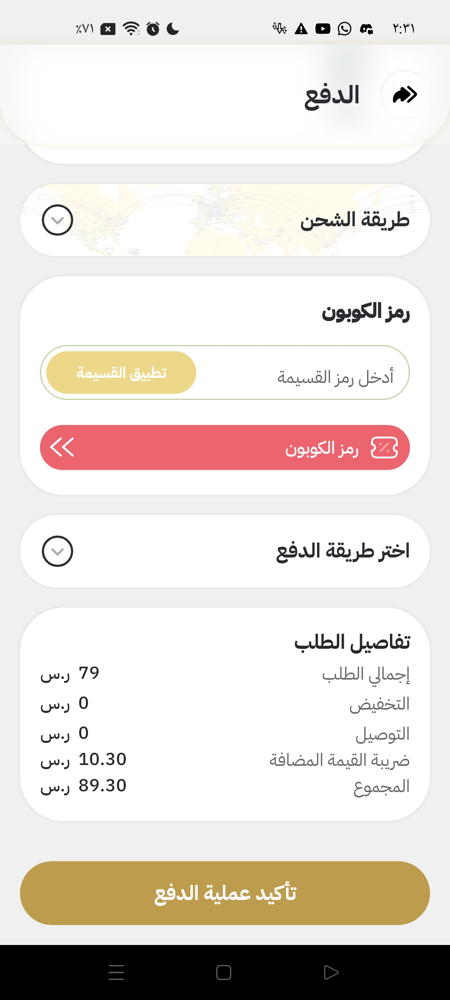
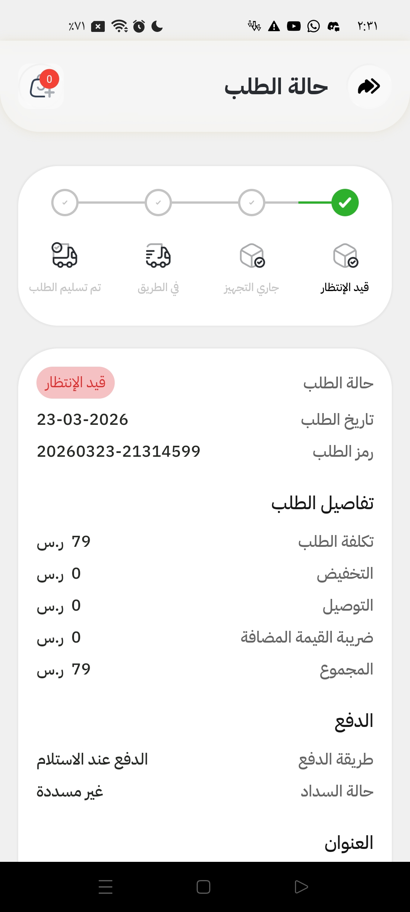

<div align="center">


# Hamsa 🛍️

### Multi-Market E-Commerce App

A large-scale e-commerce platform serving **4 regional markets** — Saudi Arabia, Yemen, Oman, and UAE.  
Each market operates with its own independent data, currency, and catalog.

<br/>

[](https://flutter.dev)
[](https://dart.dev)
[](https://bloclibrary.dev)
[](https://restfulapi.net)
[](https://github.com/AhmeedGamil)

</div>

---

## 📸 Screenshots

<div align="center">
<table>
  <tr>
    <td align="center">
      
      <br/><sub><b>Splash</b></sub>
    </td>
    <td align="center">
      
      <br/><sub><b>Market Selection</b></sub>
    </td>
    <td align="center">
      
      <br/><sub><b>Home</b></sub>
    </td>
    <td align="center">
      
      <br/><sub><b>Categories</b></sub>
    </td>
  </tr>
  <tr>
    <td align="center">
      
      <br/><sub><b>Product Detail</b></sub>
    </td>
    <td align="center">
      
      <br/><sub><b>Cart (Guest)</b></sub>
    </td>
    <td align="center">
      
      <br/><sub><b>Checkout</b></sub>
    </td>
    <td align="center">
      
      <br/><sub><b>Orders</b></sub>
    </td>
  </tr>
</table>
</div>

---

## 🎬 Demo

<div align="center">
  
</div>

> *Record your screen and convert to GIF using [ScreenToGif](https://www.screentogif.com/) (Windows) or [Gifox](https://gifox.app/) (Mac)*

---

## ✨ Features

- 🌍 **4 Regional Markets** — Saudi Arabia, Yemen, Oman, and UAE each with fully isolated data, products, pricing, and currency
- 🛒 **Guest Cart** — Add to cart without requiring login, with seamless account merge on sign-in
- 🔐 **Auth Flow** — OTP-based phone authentication per market
- 💳 **Checkout** — Secure multi-step checkout with market-specific payment options
- 🎨 **Glass UI** — Custom blur and glass morphism effects throughout the interface
- 🎬 **Animations** — Smooth transitions, hero animations, and micro-interactions
- 🔔 **Push Notifications** — Order status updates and promotional alerts
- 🌐 **RTL Support** — Full Arabic right-to-left layout support
- 📦 **Order Tracking** — Real-time order status per market

---

## 🏗️ Architecture

Clean Architecture with BLoC state management — fully decoupled presentation, domain, and data layers.

```
lib/
├── core/
│   ├── theme/              # Glass UI theme, colors, text styles
│   ├── constants/          # Market configs (SA, YE, OM, UAE)
│   ├── network/            # API client, interceptors
│   └── utils/              # Helpers, extensions
│
├── data/
│   ├── models/             # JSON serializable data models
│   ├── repositories/       # Concrete repository implementations
│   └── datasources/
│       ├── remote/         # REST API calls per market
│       └── local/          # Cart cache, user preferences
│
├── domain/
│   ├── entities/           # Pure business objects
│   ├── repositories/       # Abstract interfaces
│   └── usecases/           # Business logic (AddToCart, SwitchMarket...)
│
└── presentation/
    ├── bloc/               # BLoC + Cubit per feature
    ├── pages/              # Screens
    └── widgets/            # Reusable UI (GlassCard, AnimatedBanner...)
```

---

## 🌍 Multi-Market Architecture

One of the core technical challenges was making a single codebase support 4 fully independent markets cleanly.

```
MarketConfig
├── Saudi Arabia 🇸🇦  → SAR · Arabic/English · SA catalog
├── Yemen 🇾🇪         → YER · Arabic · YE catalog  
├── Oman 🇴🇲          → OMR · Arabic/English · OM catalog
└── UAE 🇦🇪           → AED · Arabic/English · UAE catalog
```

- Each market has its own **base URL**, **currency**, **language defaults**, and **product catalog**
- Switching markets resets the relevant BLoC state and re-fetches market-specific data
- Guest cart is stored locally and scoped per market

---

## 🛠️ Tech Stack

| Category | Technology |
|----------|-----------|
| Framework | Flutter 3.x |
| Language | Dart |
| State Management | BLoC + Cubit |
| Architecture | Clean Architecture |
| Backend | REST API (external team) |
| Local Storage | Shared Preferences + SQLite |
| UI Effects | BackdropFilter · Glass morphism |
| Animations | Flutter Animations + Hero |
| Notifications | Firebase Cloud Messaging |
| RTL | Full Arabic support |

---

## 👨‍💻 About the Developer

**Ahmed Gamil** — Flutter Developer & AI Systems Engineer.

- 🔗 [GitHub](https://github.com/AhmeedGamil)
- 💼 [LinkedIn](https://www.linkedin.com/in/ahmed-gamil-630980218/)
- 📦 [liquid_glass_easy](https://pub.dev/packages/liquid_glass_easy) — Flutter package · 5,000+ downloads
- 🎮 [Keep Flip on Steam](https://store.steampowered.com/app/2550340/Keep_Flip/)

---

<div align="center">
  <sub>This repository contains screenshots and documentation only. Source code is proprietary.</sub>
</div>
